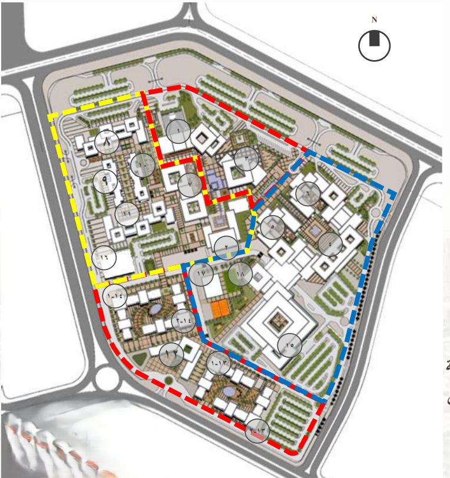

# AIU Campus Map Attachment

> Drop the aerial architectural map (image URL, Base64 data URI, or textual schematic) directly below this block. The backend streams the entire contents of this file into the LLM context before every response, so updating this file immediately refreshes the map knowledge.

---

## Textual Legend (Fallback when no image is attached)

- **Anchor:** Central Library (Building 3) sits at the heart of campus. All instructions reference this point.
- **North / Red Zone:** Administration axis leading to Building 1 and the executive offices.
- **West / Yellow Zone:** Engineering, CS & AI (Building 10), Engineering labs (Buildings 9 & 11), Business & Legal (Building 8).
- **East / Blue Zone:** Medical cluster plus student life—Hospital (Building 15), Dorms (Buildings 13 & 14), and the Sports Hall (Building 17).
- **Medical Strip:** Buildings 4–6 host Medicine, Dentistry, and Pharmacy directly north-east of the library.
- **Arts & Design:** Building 7 flanks the central courtyard west of the library.
- **Housing Corridor:** Dormitories line the eastern promenade leading to the sports complex.

Feel free to replace this fallback legend with richer annotations, contour data, or additional POIs. Keep descriptions concise so the LLM can ground directions quickly.
